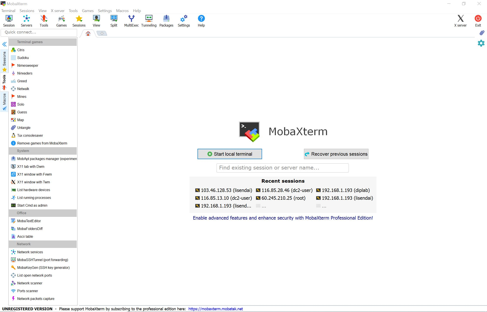
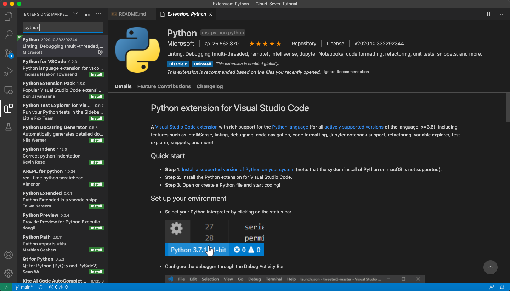
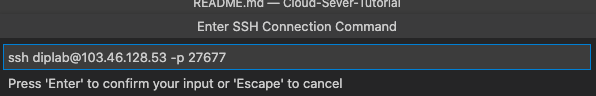

# 云服务器使用说明

## 1. 云服务器概况

### 1.1 云服务器配置、计费

#### 1.1.1 算力说明

和A534实验室本地服务器所持显卡算力比较，云服务器提供的配置可以概括如下：

|    显卡    | 算力（TFLOPS）| 显存（G） | 相对速度 |
| ---------- | ---------- | ---------- | ---------- |
| Titan XP（A534） |  10.97 | 12 | 1 |
| G4 （RTX2080） |  13.45 | 11 | 1.226 |
| Tesla T4 |  8.141 | 16 | 0.742 |
| Tesla P40 |  11.76 | 24 | 1.072 |
| Tesla P100 |  9.526 | 16 | 0.868 |
<br>
我们主要使用RTX2080的显卡助力计算，系统选择Ubuntu。

<br>
<br>

#### 1.1.2 计费说明

计费内容包含三项：开机计算，存储和传输带宽
<br>
下表中，虚拟金币和人民币兑换比例为：1：0.92

|    项目    | 单位数量单位时间价格|
| ---------- | ---------- |
| 1块RTX2080显卡配上8核i5 CPU |  5.84金币 / 小时 |
| 存储空间 | 最低80G，需要 0.02金币 / 小时。超过80G的部分增加量需为 50G 的倍数，每增加50G需要 0.015金币/小时，四舍五入保留两位小数 |
| 传输带宽（按带宽计费） | 5M及以下时为每小时 0.03金币 / Mbps，多出5M的部分需要增加每小时 0.135金币 / Mbps |
| 传输带宽（按流量计费） | 0.78金币 / G，带宽大小可自选，上限100Mpbs |


* 举例说明，180G 存储容量，10Mbps 带宽需要付费 (0.02 + 2 * 0.015) + (0.03 * 5 + 0.135 * 5) = 0.83 金币 / 小时 (0.825四舍五入的结果)  。
* 关机状态下，“开机计算”和“传输带宽”不计费，但是存储容量仍然计费。

<br>

## 2. 远程交互
云主机创建之后，会获得:<br>
* 云主机的ip地址
* 开放端口
* 用户名和密码（用户身份，无管理员权限）

云服务器已经为我们配置好了相关的应用。所以我们只需要利用这些信息，直接访问远程服务器即可。
<br>

### 2.1 MobaXTerm


MobaXterm中除了ssh功能之外，也集成了很多丰富的辅助功能。其中比较重要的辅助功能有：远程服务器GUI连接、SFTP文件传输GUI及文件修改自动化。<br>
<center class="half">
    
</center>
我们可以利用文件修改自动化功能直接更改远程服务器上的文件中的代码（原理是在SFTP协议下先把代码文件下载到本地，然后用自带的文本编辑器打开，修改完后再上传替换远程端源文件）。由于自带的文本编辑器仅能阅读和修改文件，缺少代码提示、高亮和调试功能等，所以这种方式只适合简单修改。可以先将代码在本地大体上跑通，然后放在服务器上做二次调试和运行。

<br>
<br>

### 2.2 远程调试
使用远程调试可以十分方便地“把服务器上的环境当成自己的环境一样用”。而调试功能也可以迅速对可能出现的问题进行定位。<br>
目前几乎所有主流的IDE或者文本编辑器都支持远程开发功能。其中，绝大多数需要收费（这其中一般对开源工作者和教育工作者、学生免费）。以Pycharm为例，免费的社区版并不支持远程调试。<br>
我们以开源软件 Visual Studio Code为例来说明远程调试如何工作。<br>
```
官方网站： https://code.visualstudio.com
```
首先，安装VScode软件。然后安装官方的python插件：
<br>

然后，安装远程调试相关插件：<br>

<br>
点击右下角的，然后在弹出的对话框中选择 "Remote-SSH: Connect to Host..."<br>

……选择新添加一个配置，会弹出要求输入用户名、IP地址和端口的对话框，以A534机器为例：<br>

<br>
会弹出要求输入密码的对话框，输入密码后就可以成功连接上了。
<br>
现在需要打开对应的文件夹开始调试<br>

