# 云服务器使用说明

这里主要介绍一些云服务器[AI智算云](https://ai.blsc.cn/)的通用说明和使用技巧。如果需要具体了解云服务器的使用规则，请看[云服务器使用规则](Rules.md)。

## 1. 云服务器概况

### 1.1 云服务器配置、计费

#### 1.1.1 算力说明

和A534实验室本地服务器所持显卡算力比较，云服务器提供的配置可以概括如下：

|    显卡    | 算力（TFLOPS）| 显存（G） | 相对速度 |
| ---------- | ---------- | ---------- | ---------- |
| Titan XP（A534） |  10.97 | 12 | 1 |
| G4 （RTX2080） |  13.45 | 11 | 1.226 |
| Tesla T4 |  8.141 | 16 | 0.742 |
| Tesla P40 |  11.76 | 24 | 1.072 |
| Tesla P100 |  9.526 | 16 | 0.868 |
<br>
我们主要使用RTX2080的显卡助力计算，系统选择Ubuntu。
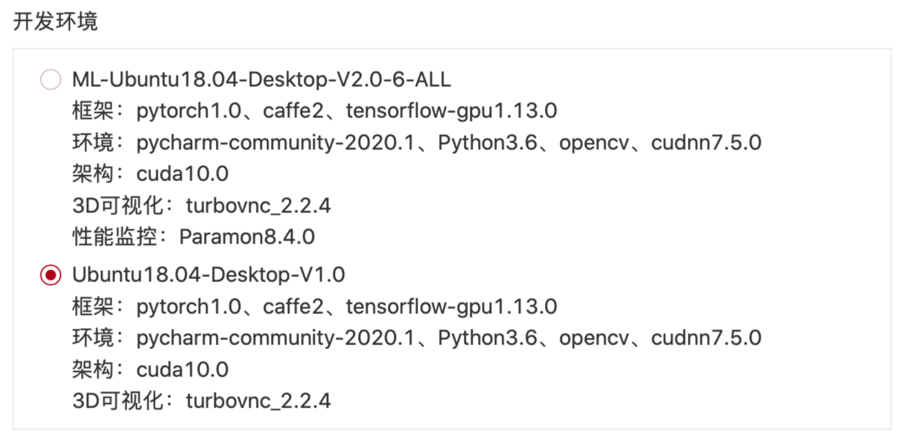
<br>
<br>

#### 1.1.2 计费说明

计费内容包含三项：
- 开机计算
- 存储
- 传输带宽

下表中，虚拟金币和人民币兑换比例为：1：0.92

|    项目    | 单位数量单位时间价格|
| ---------- | ---------- |
| 1块RTX2080显卡配上8核i5 CPU |  5.84金币 / 小时 |
| 存储空间 | 最低80G，需要 0.02金币 / 小时。超过80G的部分增加量需为 50G 的倍数，每增加50G需要 0.015金币/小时，四舍五入保留两位小数 |
| 传输带宽（按带宽计费） | 5M及以下时为每小时 0.03金币 / Mbps，多出5M的部分需要增加每小时 0.135金币 / Mbps |
| 传输带宽（按流量计费） | 0.78金币 / G，带宽大小可自选，上限100Mpbs |


* 举例说明，180G 存储容量，10Mbps 带宽需要付费 (0.02 + 2 * 0.015) + (0.03 * 5 + 0.135 * 5) = 0.83 金币 / 小时 (0.825四舍五入的结果)  。
* 关机状态下，“开机计算”和“传输带宽”不计费，但是存储容量仍然计费。

<br>

## 2. 创建一个适合使用的云主机
按照已知的账户登陆进[AI智算云](https://ai.blsc.cn/)，点击“控制台”以进入如下界面。
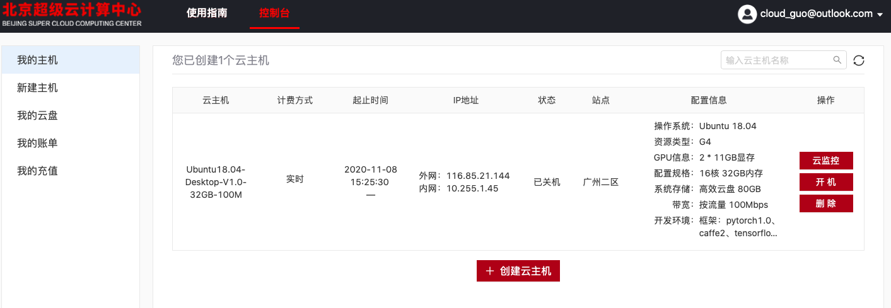
点击 **“创建云主机”**，进入云主机创建列表。<br>
按照如下说明进行创建：


| 计费方式 | 实时 |
| ------- | ------- |
| 资源类型 |  G4（目前最快的配置）|
| 资源配置 | 推荐为1显卡。增开显卡的数量按需进行选择 |
| 操作系统 | Ubuntu：Ubuntu18.04-Desktop-V1.0 |
 |系统云盘 | 80G |
| 数据云盘 | 无需添加 |
| 站点 | 广东二区 |
| 带宽 | 推荐为按使用流量，带宽100Mpbs。按需选择按固定带宽 |

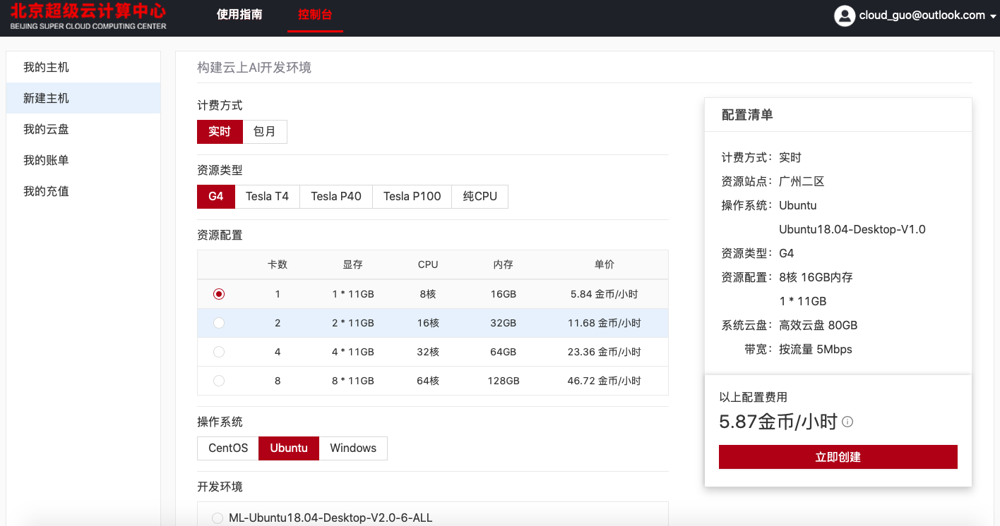<br>
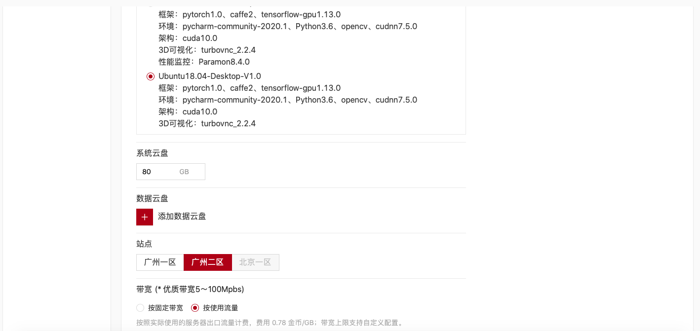<br>
<br>
<br>
开机成功后，如下图所示：<br>
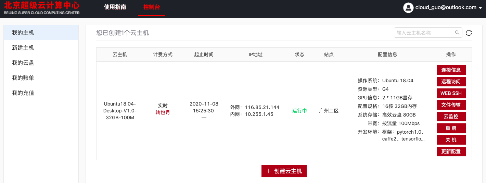<br>
右侧有一些浏览器附带的简单交互功能，可以体验。这些功能的流畅性都会受到**带宽**的影响。
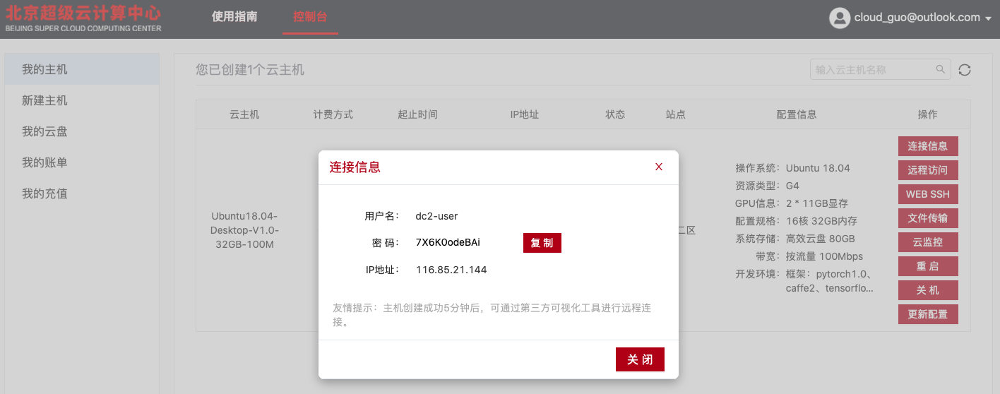<br>
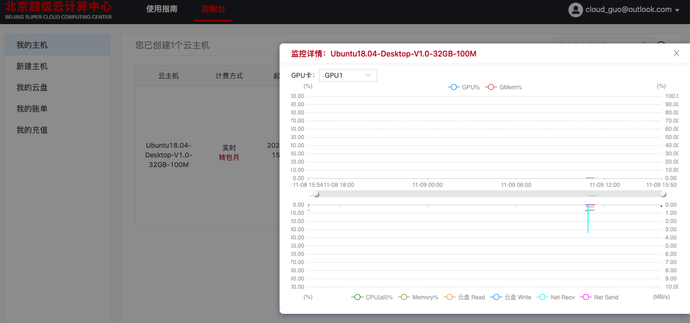<br>
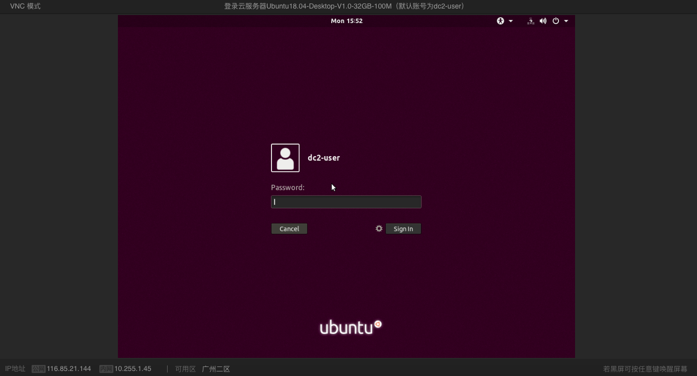<br>
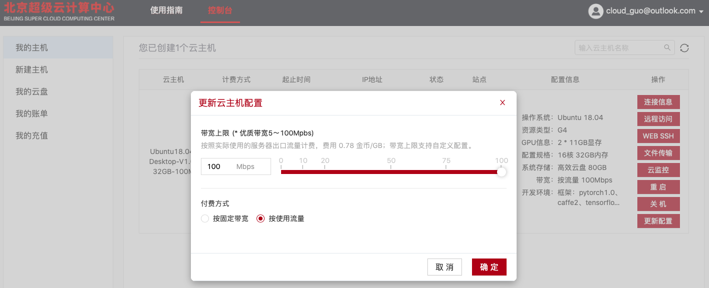<br>
关机操作中会弹出如下说明，若点了**确定**后关机速度很慢，属于正常现象。关闭计算机之后，有且仅有储存计费，其他如开机使用（占绝大部分开支）、传输带宽流量，都不计费。
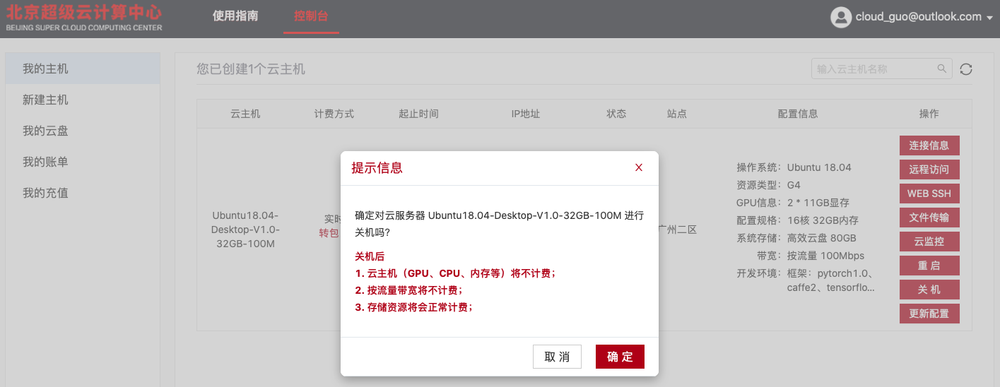<br>
关机之后，可以择合适时机再开启，届时所有的硬盘储存数据不会丢失（关机时即session终止），可以重新读取储存继续工作。<br>
**删除**是彻底抹掉这台虚拟机。关机不影响硬盘存储，而删除之后数据也将清空，所有的信息都会丢失。**删除**后存储空间由于释放完了，也不会计费，停止此机器一切计费并且列表中不会显示该机器。<br>
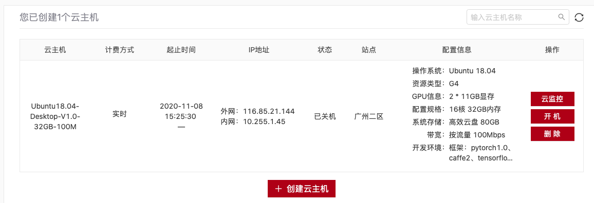 <br>
其他的机器的数据不会丢失。<br>


## 3. 远程交互
云主机创建之后，会获得:（在“连接信息”中可以查看）<br>
* 云主机的ip地址
* 开放端口
* 用户名和密码（用户身份，无管理员权限）

<br>

云服务器已经为我们配置好了相关的应用。所以我们只需要利用这些信息，直接访问远程服务器即可。
网页版自带终端界面和图形化界面应用，推荐作为简易使用的用途。
<br>

### 3.1 MobaXTerm

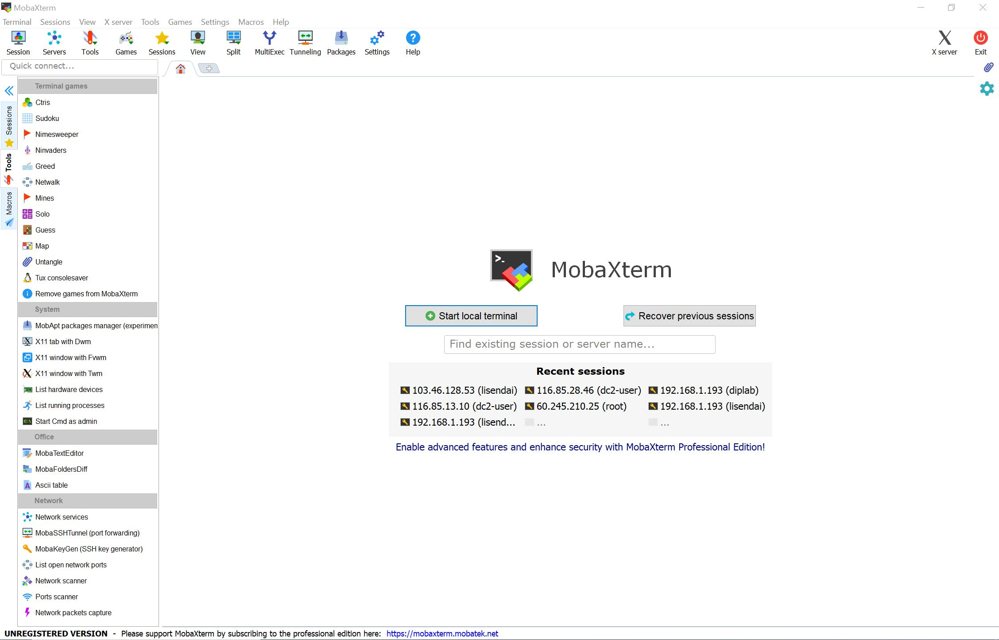
MobaXterm中除了ssh功能之外，也集成了很多丰富的辅助功能。其中比较重要的辅助功能有：远程服务器GUI连接、SFTP文件传输GUI及文件修改自动化。<br>
<center class="half">
    
</center>
我们可以利用文件修改自动化功能直接更改远程服务器上的文件中的代码（原理是在SFTP协议下先把代码文件下载到本地，然后用自带的文本编辑器打开，修改完后再上传替换远程端源文件）。由于自带的文本编辑器仅能阅读和修改文件，缺少代码提示、高亮和调试功能等，所以这种方式只适合简单修改。可以先将代码在本地大体上跑通，然后放在服务器上做二次调试和运行。<br>
和A534机器的用法一样。

<br>
<br>


### <span id=goback> 3.2[**](#comment1) 远程调试 </span>
使用远程调试可以十分方便地“把服务器上的环境当成自己的环境一样用”。而调试功能也可以迅速对可能出现的问题进行定位。<br>
目前几乎所有主流的IDE或者文本编辑器都支持远程开发功能。其中，绝大多数需要收费（这其中一般对开源工作者和教育工作者、学生免费）。以Pycharm为例，免费的社区版并不支持远程调试。<br>
我们以开源软件 Visual Studio Code为例来说明远程调试如何工作。<br>
```
官方网站： https://code.visualstudio.com
```
首先，安装VScode软件。然后安装官方的python插件：
<br>

然后，安装远程调试相关插件：<br>
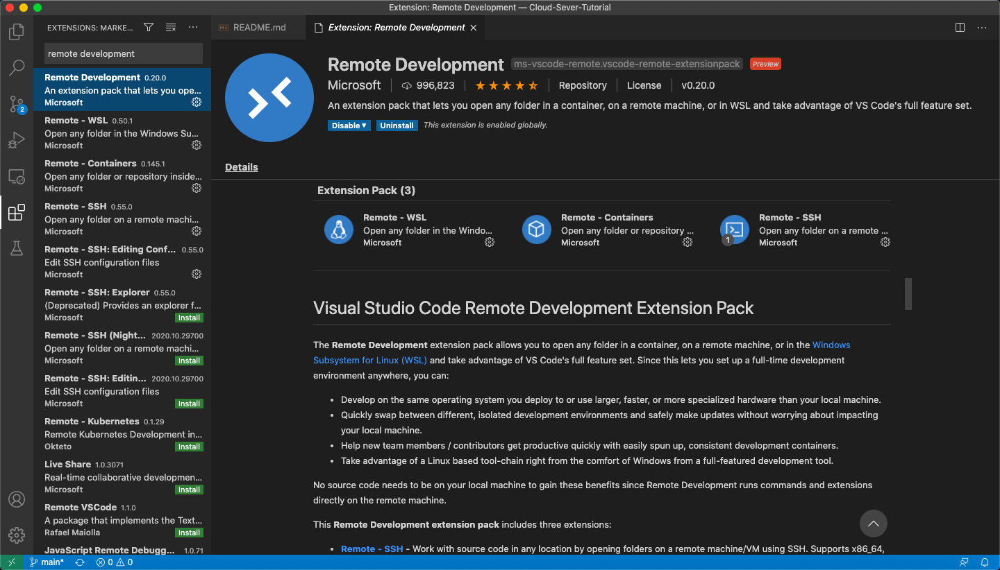
<br>
点击右下角的，然后在弹出的对话框中选择 "Remote-SSH: Connect to Host..."<br>
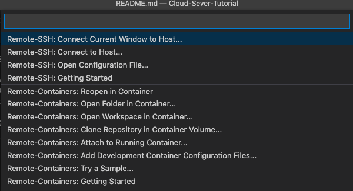
……选择新添加一个配置，会弹出要求输入用户名、IP地址和端口的对话框，以A534机器为例：<br>
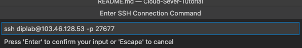
<br>
会弹出要求输入密码的对话框，输入密码后就可以成功连接上了。
<br>
现在需要打开对应的文件夹开始调试<br>
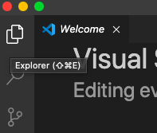

<br>
<br>

## 4. PyTorch并行计算（torch.nn.DataParallel）
### 4.1 基本组成
设置GPU并行计算只需要几个步骤即可<br>
(1) 导入 torch.nn 库 <br>
(2) 设置参与计算的GPU，是按照列表形式组织的。 `gpus = [0,1]` 表示 GPU 0 和 GPU 1 参与计算。<br>
(3) 将模型加载到各个GPU上<br><br>
对应代码：<br>

```
import torch.nn as nn
``` 
```
gpus = [_ for _ in range(num_gpus)]
```
这里的num_gpus需要按照实际情况修改。
<br>
也可以用这个函数返回GPU数量代替num_gpus：
```
torch.cuda.device_count()
```

最后的parallel用法为：
```
model = nn.DataParallel(model.cuda(), device_ids=gpus, output_device=gpus[0]) 
```
其中，output_device不建议修改。
<br>

### 4.2 基本原理
`torch.nn.DataParallel` 可以将模型发送到多个GPU上进行并行计算，每个GPU都有一个模型的副本。训练时，每一批 *(batch)* 的数据会被均匀地分配到所有GPU上进行处理，计算的梯度会被汇总到原始的模型中进行更新。
<br>
几个注意事项：<br>
- 务必保证批的大小(batchsize)大于使用的GPU的数量。<br>
- 在这个训练过程中，因为梯度会被汇总，所以不涉及改变批的大小(batchsize)的问题。<br>
- 因为汇总梯度等原因，GPU(0)一般要被占用更多的显存。

### 4.3 GPU 选择
GPU编号有两类，PyTorch是根据显卡性能进行降序排序的，也就是说程序中调用的第一个GPU(cuda:0)一定是性能最强的。`nvidia-smi` 命令显示的显卡信息是按照总线的顺序进行排序的。

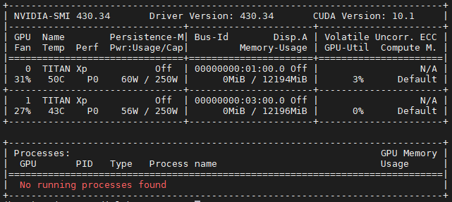

(1) 强制PyTorch使用总线顺序：
```
import os
os.environ["CUDA_DEVICE_ORDER"]="PCI_BUS_ID"
```
(2) 特殊情况下，使用一部分GPU进行计算（这个例子说的是，此处使用2号和3号GPU，分别传递给CUDA，作为CUDA中的顺序0号和1号）:
```
import os
os.environ["CUDA_DEVICE_ORDER"] = "PCI_BUS_ID"
os.environ["CUDA_VISIBLE_DEVICES"] = "2, 3"
gpus = [0,1]
model = nn.DataParallel(model.cuda(), device_ids=gpus, output_device=gpus[0]) 
```
这里指定了总线序号为2和3的两个GPU作为 `cuda:0` 和 `cuda:1` 。
<br>
<br>
<br>
***

正文部分结束，如果需要具体了解云服务器的使用规则，请移步至[云服务器使用规则](Rules.md)。

<br>
<br>
<span id=comment1>
**
</span>

此处内容仅作为便利性参考，建议忽略。 
[返回](#goback)

